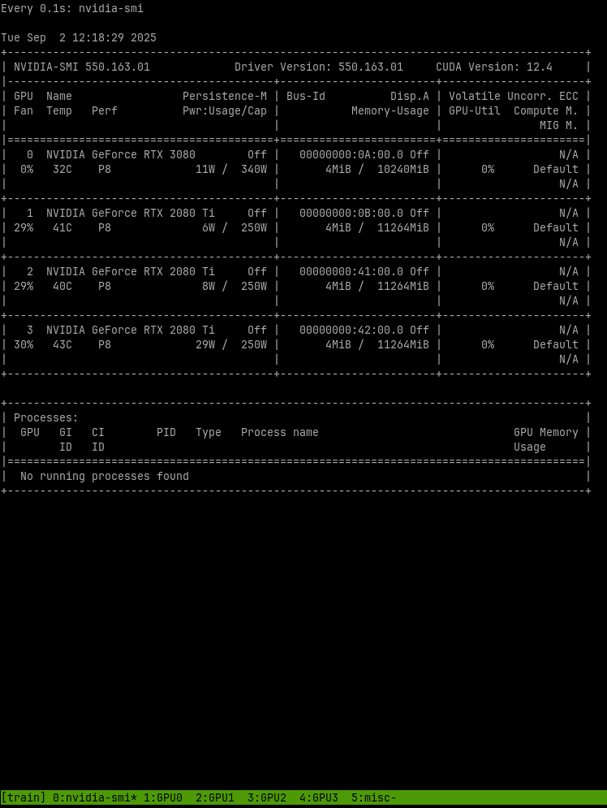

# tmux-cuda-session-creator
A simple script to create a tmux session with multiple windows for development with CUDA GPUs.

It creates a tmux session with the following windows:
1. A window with `nvidia-smi` running continuously, to monitor the GPU usage.
2. A window for each GPU detected, with the `CUDA_VISIBLE_DEVICES` environment variable set to the GPU index.
3. A miscellaneous window.



And that's it! You can now run your code in the terminal windows of the GPUs you want to use.

To use it, just run the script:
```bash
./tmux-creator.sh
```

If you want to add the script as a global binary, you can run the setup script:
```bash
./setup.sh
```

This will create a symlink to the script in `~/.local/bin/tmux-creator`, so you can run it from anywhere by just typing:
```bash
tmux-creator
```